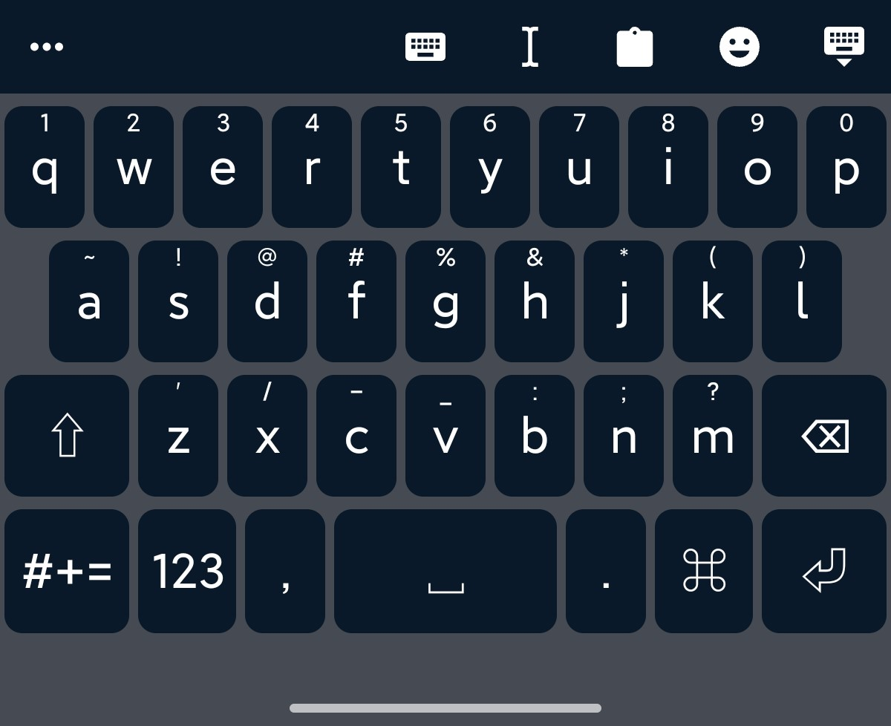
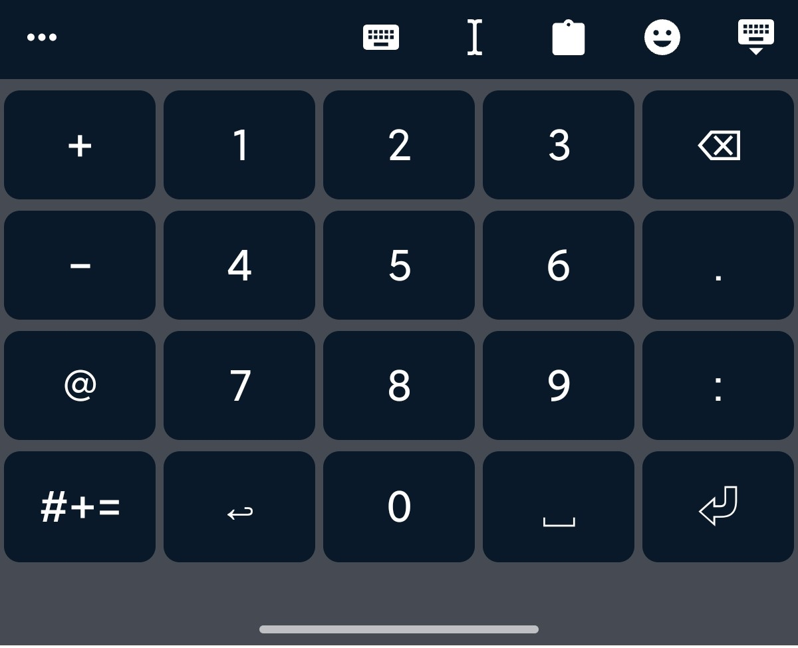
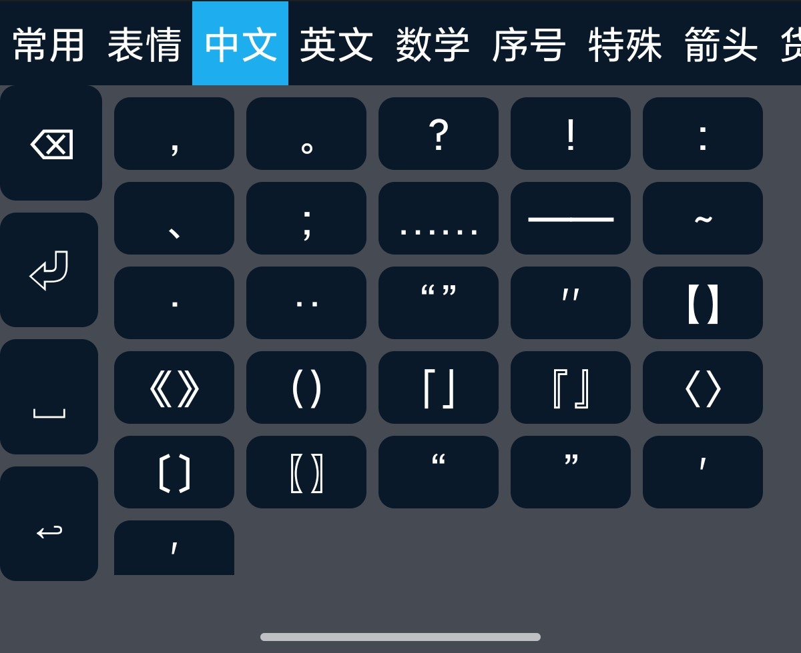
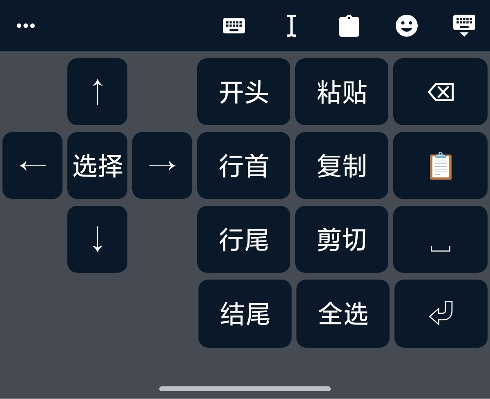

# 共键双拼输入

> Trime 18 键共键双拼输入方案与主题
> 主题设计参考手心输入法, 实现参考 tongwenfeng
> 输入方案基于 moqi-xh 修改

## 特性

- 仿手心输入法 18 键布局
- 使用模糊音实现共键输入
- 左右滑动精确输入
- 支持双拼辅助码（2 码音/3 码音+形/4 码音+形）
- For Trime
- **当前 repo 中的方案与主题强相关，大部分情况下只能一起使用**

## 布局预览

| 中文 | 英文 |
|:---:|:---:|
|  |  |

| 数字 | 符号 | 编辑 |
|:---:|:---:|:---:|
|  |  |  |

## 安装

### 前置要求

- Trime v3.3.8+
- ADB (可选)

### 安装步骤

#### 1. 下载所有文件

**墨奇方案**（必需）

```bash
git clone https://github.com/gaboolic/rime-shuangpin-fuzhuma
```

**本项目**

```bash
git clone https://github.com/hxlh50k/trime-sharedkey-shuangpin
```

#### 2. 准备文件结构

将两个 repo 中内容合并到一个文件夹

#### 3. 部署到手机

**使用自动化脚本**（推荐）

```bash
cd Tools

# 执行部署
init_deploy_android.bat
```

如果你没有 adb，参考此 bat 中的文件手动复制，或者全复制进去也行。

#### 4. 启用方案

1. 打开 Trime → 部署
2. 方案选单 → 启用"MQ+XH 18 键"
3. 键盘设置 → 选择"手心式 18 键"

## 文件说明

**方案配置**:

- `moqi_xh-18key.schema.yaml` - 18 键方案
- `shouxin_18key.trime.yaml` - 18 键键盘布局

**Lua 脚本**:

- `lua/sharedkey_shuangpin_precise_input_processor.lua` - 精确输入处理器
- `lua/sharedkey_shuangpin_precise_input_filter.lua` - 精确输入过滤器

**部署脚本**:

- `Tools/init_deploy_android.bat` - 完整部署
- `Tools/deploy_android.bat` - 快速更新

### 依赖项（需单独下载）

**墨奇码** (github.com/gaboolic/rime-shuangpin-fuzhuma)

- `moqi.yaml` - 核心配置
- `moqi.extended.dict.yaml` - 主词典
- `moqi_big.extended.dict.yaml` - 大字集
- `moqi_big.schema.yaml` - 大字集方案
- `reverse_moqima.dict.yaml` - 反查
- `cn_dicts_moqi/*` - 词库目录
- `opencc/moqi_chaifen*` - 拆分配置

**sbxlm** (github.com/sbsrf/sbxlm)

- `lua/sbxlm/lib.lua` - Lua 工具库

**可选组件**（推荐）

- Emoji、英文、日语输入方案和词典
- 通用 Lua 脚本（日期、农历、计算器等）
- 其他 OpenCC 配置

## 使用说明

### 基本输入

```
纯音: ui → 时、是、事...
三码: uio → 时 ui[o → 时
四码: ui[oc → 时
```

### 精确输入（消除共键模糊）

**共键对**: WE、RT、IO、SD、FG、JK、XC、BN

**操作方式**:

- **点击 WE 键** → w（模糊匹配，可能是 w 或 e）
- **左滑 WE 键** → W（精确匹配 w）
- **右滑 WE 键** → E（精确匹配 e）

Known issue: 中文模式下长按 Popup 输入大写字母也能精确输入, 但是输入小写字母还是会模糊解析

**示例**:

```
点击WE + 点击IO → wo/wi/eo/ei（模糊）
左滑WE + 点击IO → wo/wi（W精确，O模糊）
左滑WE + 右滑IO → wo（完全精确）
```

### 形码引导键

左下角 `㇕'` 键：

- **点击** → `[`（形码引导符）
- **上滑** → `'`（分词符）

### 快捷输入（来自 moqi）

- `ae` + 字母 → Emoji
- `aw` + 字母 → 英文单词
- `aj` + 字母 → 日语

### 多功能键

- 单击切换 中/EN
- 长按切换系统输入法
- 右滑切换配色
- 上滑切换方案

## 参考与致谢

### 主题设计与配置

- [gaboolic](https://github.com/gaboolic) - 墨奇音形
- Rime 社区
- [手心输入法](https://www.xinshuru.com)
